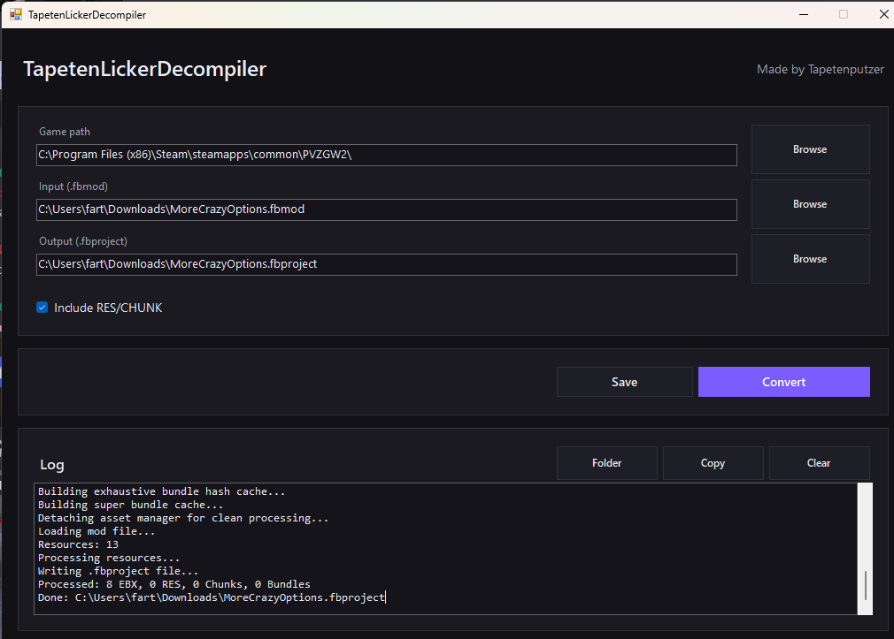

# TapetenLickerDecompiler (FBMOD → FBPROJECT)

A small Windows tool that converts **Frosty `.fbmod`** files into **`.fbproject`** format so projects can be opened/inspected in a Frosty-based workflow.

This is a GUI-based fork/modification of an original converter/decompiler concept.

---

## What it does

- Converts a single **`.fbmod`** into a **`.fbproject`**
- Reads mod resources and writes them into a project container:
  - **EBX**
  - **RES** (optional)
  - **CHUNK** (optional)
  - **Bundles** (if present)
- Automatically builds a **bundle hash cache** from the game installation so bundle references resolve more reliably.
- Supports **drag & drop** for `.fbmod` files.
- Generates an output `.fbproject` next to the input by default (can be changed).

---

## How it works (high level)

1. Initializes Frosty SDK using the detected game profile key.
2. Builds a cache of bundle names and superbundles from the game files to map hashes back to names.
3. Loads the `.fbmod` with `FrostyModReader`.
4. Iterates all resources:
   - EBX is parsed and rewritten into project format when possible.
   - If EBX parsing fails, it falls back to storing raw/custom data so the resource is still kept.
   - RES/CHUNK can be included or excluded via a toggle.
5. Writes everything into a `.fbproject` file using a native writer.

---

## Requirements

- Windows
- .NET (the version your project targets, e.g. .NET Framework used by the Frosty libraries)
- A supported Frostbite game install folder (example default):
  - `C:\Program Files (x86)\Steam\steamapps\common\PVZGW2\`

> The tool needs a valid game path so the Frosty SDK can load profiles and enumerate bundles/superbundles.

---

## Usage

### GUI
1. Start the app.
2. Set **Game path** (your game install folder).
3. Select an input **`.fbmod`** (or drag & drop it into the window).
4. Choose the output **`.fbproject`** path.
5. Click **Convert**.

### Drag & Drop
- Drop a `.fbmod` file onto the window to auto-fill input and output paths.

---

## Settings / Options

- **Include RES/CHUNK**
  - ON: writes RES + CHUNK resources into the project
  - OFF: skips them (useful if the Frosty editor crashes on some projects)

- **path.txt**
  - The tool stores your last used game path in `path.txt` in the same folder as the executable.

---

## Notes about missing assets

Some mods contain assets that can’t be parsed as “standard” EBX using the normal reader path (e.g. certain localization assets).  
In those cases the tool may keep the resource via a fallback/custom handler so it’s not lost, but it may not appear nicely in all editors.

The log output helps identify:
- EBX that was rewritten normally
- EBX that required fallback handling
- any read/parse errors

---

## Credits

- Original concept/tooling by **verionz**
- This version/modifications by **Tapetenputzer**

---

## Disclaimer

This project is provided for educational and interoperability purposes.  
You are responsible for how you use it and for complying with the game’s EULA, modding policies, and applicable laws.
